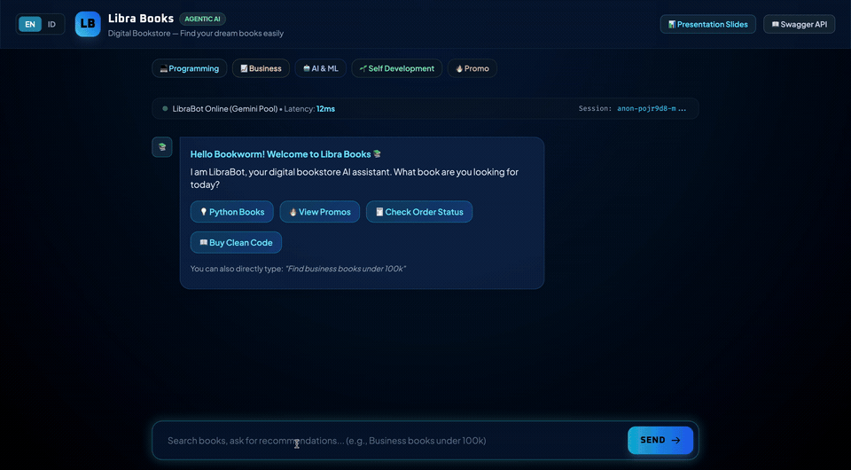
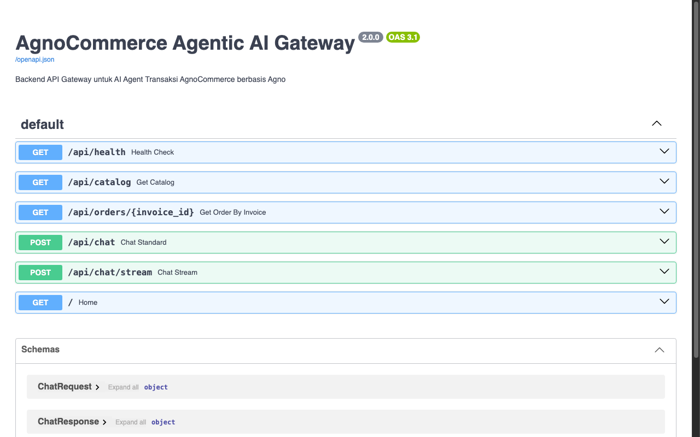

# agno-commerce-agent

A production-ready **Agentic AI Gateway** built with [Agno](https://github.com/agno-agi/agno) and FastAPI — enabling natural language interactions for e-commerce transactions, catalog browsing, and order management.



## What It Does

Users chat naturally with an AI agent that can:
- 🛒 Browse product catalogs across multiple game titles
- 📦 Create and track orders with auto-generated invoices
- 💬 Stream responses in real-time via SSE
- 🔄 Maintain session memory across conversations

## Tech Stack

| Layer | Tech |
|-------|------|
| Agent Framework | [Agno](https://github.com/agno-agi/agno) |
| API Server | FastAPI + SSE Streaming |
| AI Providers | Gemini (multi-key pool) · OpenRouter · Ollama |
| Frontend | Vanilla HTML/CSS/JS |
| Deployment | Docker |

## Architecture

```
User → Chat UI → FastAPI → Agno Agent → Function Tools → Mock DB
                        ↳ Rate Limiter (15 req/min)
                        ↳ Session Manager
                        ↳ Multi-Provider AI Failover
```

## API Endpoints

| Method | Endpoint | Description |
|--------|----------|-------------|
| GET | `/api/health` | Server health check |
| GET | `/api/catalog` | List all products |
| POST | `/api/chat` | Chat with agent (sync) |
| POST | `/api/chat/stream` | Chat with agent (SSE streaming) |
| GET | `/api/orders/{id}` | Get order status |



## Quick Start

```bash
git clone https://github.com/khoirulyahya/agno-commerce-agent
cd agno-commerce-agent

cp .env.example .env
# Add your API key in .env

python -m venv venv && source venv/bin/activate
pip install -r requirements.txt

python server.py
# → http://localhost:8000
```

Or with Docker:
```bash
docker build -t agno-commerce-agent .
docker run -p 8000:8000 --env-file .env agno-commerce-agent
```

## Key Features

- **Multi-provider failover** — auto-switches between Gemini keys, falls back to OpenRouter/Ollama
- **Real-time streaming** — SSE for token-by-token responses
- **Rate limiting** — 15 requests/min per IP, no auth required
- **Function calling** — Agno tools auto-converted from Python functions
- **Session memory** — context persists across conversation turns

## Tutorials

Progressive examples in `/tutorials`:
1. `01_hello_agno.py` — Basic agent setup
2. `02_tools_and_transactions.py` — Function tools
3. `03_memory_and_sessions.py` — Session management
4. `04_rapspoint_cli.py` — CLI agent interface
5. `05_vision_to_action.py` — Multimodal input
6. `06_voice_to_action.py` — Voice commands

## License

MIT
